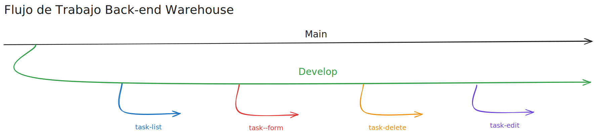
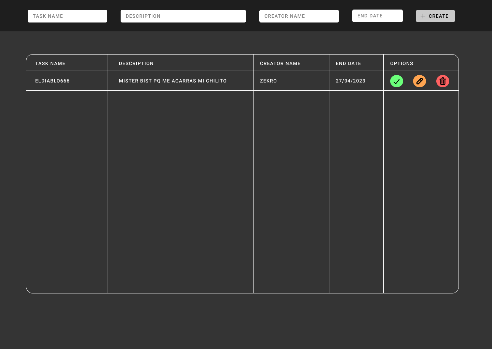

# React_Warehousing_Company (In Development)

## Important

Hey devs your scrum here! as you know the workflow for the frontend will be the same as the backend so you keep developing what your assigned branch tells you to, below here you have the design of what our App should look like when we finish working, as well i will post the branch description here too, good luck!.

## Feature Branches

`feature/task-list`

Branch to develop the task list component (TaskList).

`feature/task-form`

Branch to develop the form to add tasks.

`feature/task-delete`

Branch to develop the delete task functionality

`feature/task-edit`

Branch to develop the edit and mark tasks as done functionalities

## Design

